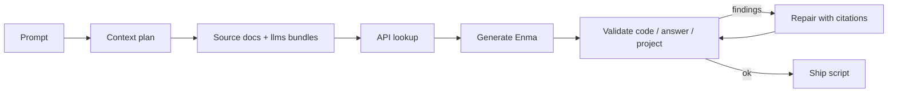
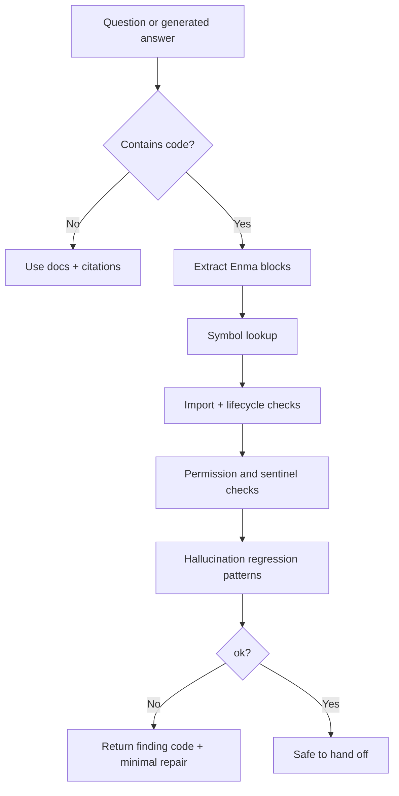

<div align="center">


# pcx-ai-toolkit

### Source-grounded AI infrastructure for Perception.cx Enma

[](https://github.com/VoidChecksum/pcx-ai-toolkit/actions/workflows/ci.yml)
[](LICENSE)
[](#language-contract)
[](#ai-workflow)
[](#mcp)
[](#native-re-toolchain)

**Make LLMs write Perception.cx scripts from verified Enma sources, not guessed APIs.**

`llms.txt` bundles · source-backed API oracle · MCP server · code validators · hallucination evals · templates · native RE helpers

[Install](#install) · [AI workflow](#ai-workflow) · [Validation](#validation-pipeline) · [MCP](#mcp) · [Coverage](#coverage) · [Safety](#safety)

</div>

---

## The point

LLMs are good at syntax shape and terrible at knowing which Perception APIs actually exist. `pcx-ai-toolkit` gives them a grounded contract:



<table>
<tr>
<td width="50%" valign="top">

### Built for

- Perception.cx Enma scripting
- AI agents that need small, precise context
- MCP clients that need lookup and validation tools
- Reverse-engineering workflows that need evidence discipline
- Users who want copy-paste setup and predictable checks

</td>
<td width="50%" valign="top">

### Not built for

- Invented helper APIs like `draw_esp()`
- AngelScript, Lua, or historical bindings as an AI target
- Offset dumps without source evidence
- Malware, credential theft, or unauthorized targets
- Guessing when docs are silent

</td>
</tr>
</table>

## Install

### npm / Bun

```bash
npm install -g pcx-ai-toolkit
# or
bun add -g pcx-ai-toolkit

pcx doctor
pcx ai-smoke
```

### Python

```bash
python -m pip install pcx-ai-toolkit
pcx doctor
pcx ai-smoke
```

### Source checkout

```bash
git clone --recursive https://github.com/VoidChecksum/pcx-ai-toolkit.git
cd pcx-ai-toolkit
./setup.sh
pcx doctor
```

### Windows PowerShell

```powershell
git clone --recursive https://github.com/VoidChecksum/pcx-ai-toolkit.git
cd pcx-ai-toolkit
powershell -ExecutionPolicy Bypass -File setup.ps1
pcx doctor
```

Requirements: Git, Python 3.10+, Node.js 18+. Rust/Cargo enables native RE binaries. Submodules are required for LSP and VSIX packaging.

Update later with one command:

```bash
pcx update
npm install -g pcx-ai-toolkit@latest
python -m pip install --upgrade pcx-ai-toolkit
```

Release publishing uses PyPI Trusted Publisher and npm Trusted Publisher where configured. Workflow filename: `release.yml`.

## First command by job

| Job | Command / file | Result |
|---|---|---|
| Need model instructions | `pcx prompt --model claude` | Copy-paste anti-hallucination prompt |
| Need setup targets | `pcx agent-install --dry-run` | Shows client install plan |
| Need API proof | `pcx api draw_text` | Exact signatures and source URLs |
| Need script validation | `pcx verify file.em` | Lint + symbol checks |
| Need project validation | `pcx verify-project ./project` | Project hygiene + evidence gates |
| Need answer validation | `pcx check-answer answer.md` | Checks fenced code blocks |
| Need all docs gates | `pcx docs-check` | Regeneration, drift, eval, focused tests |
| Need MCP workflow | `mcp/pcx-knowledge-mcp/` | Search, fetch, lookup, validate, scaffold |
| Need persistent agent memory | `pcx prism` | Optional Prism setup plan for PCX workflows |

Task guides: [validate Enma](docs/quickstarts/validate-enma.md), [use the knowledge MCP](docs/quickstarts/use-knowledge-mcp.md), [create a scaffold](docs/quickstarts/create-project.md), [run live Perception MCP checks](docs/quickstarts/live-perception-mcp.md), [use Prism memory](docs/quickstarts/use-prism-memory.md).

## Language contract

This toolkit intentionally targets **Perception-supported Enma (`.em`)**.

```text
Entrypoint:       int64 main()
Routine install: register_routine(cast<int64>(fn), data)
Routine shape:   void fn(int64 data)
Arrays:          T[]
Maps:            map<K,V> for string keys; imap<V> for integer keys
Render shapes:   vec2(...), color(r,g,b,a), documented draw_* calls only
Validation rule: if docs/API index do not prove it, do not use it
```

AngelScript (`.as`), Lua, C++ helper syntax, JavaScript `await`, `ImGui::*`, and game-specific helpers are rejected or flagged by validators.

## AI workflow

| Docs | Doc Lines | API Docs Indexed | API Functions | API Methods | Skills | Templates | MCP Tools | Native Tools |
|---:|---:|---:|---:|---:|---:|---:|---:|---:|
| 133 | 22,496 | 53 | 828 | 377 | 32 | 18 | 59 | 13 |

### Minimal context load

```text
1. Read docs/AI_AGENT_OPERATING_MANUAL.md
2. Read docs/perception/llm-routing.md
3. Load docs/llms-perception-enma.md
4. Verify every API name with pcx api or MCP api_lookup
5. Validate final code with pcx verify, validate_code, or validate_answer
```

### Copy-paste model instruction

```text
You are writing Perception.cx Enma only.
Before code, load docs/AI_AGENT_OPERATING_MANUAL.md and docs/perception/llm-routing.md.
Use docs/llms-perception-enma.md as the primary context pack.
Do not use AngelScript, Lua, ImGui, C++ templates, or invented game helpers.
Verify every Perception host API and Enma add-on symbol with pcx api or MCP api_lookup.
Run validation before final answer. If the API index does not prove a symbol exists, say it is unverified instead of guessing.
```

### Choose a context surface

| Surface | Path | Best when |
|---|---|---|
| Entry index | [docs/llms.txt](docs/llms.txt) | Tool auto-fetches `llms.txt` |
| Enma pack | [docs/llms-perception-enma.md](docs/llms-perception-enma.md) | One-language Perception scripting session |
| Full pack | [docs/llms-full.txt](docs/llms-full.txt) | Tool accepts one large file |
| Skills pack | [docs/llms-skills.md](docs/llms-skills.md) | Agent needs operating rules |
| Knowledge pack | [docs/llms-knowledge.md](docs/llms-knowledge.md) | Agent needs patterns and RE context |
| API oracle | [knowledge/pcx-api-index.json](knowledge/pcx-api-index.json) | Exact symbol/signature lookup |
| Dynamic MCP | [mcp/pcx-knowledge-mcp](mcp/pcx-knowledge-mcp) | Long sessions and lazy retrieval |

## Validation pipeline



| Failure mode | Gate |
|---|---|
| Invented API names | `pcx api`, `knowledge/pcx-api-index.json`, MCP `api_lookup` |
| Wrong lifecycle | `validate_code`, `symbol-check`, routine-shape checks |
| Missing imports | Enma module hints for `vec`, `color`, `math`, `json`, and others |
| Wrong argument shape | argument-count and rough constructor-shape validation |
| Permission-sensitive APIs | permission metadata and `knowledge/permission-rules.json` |
| Bad Markdown answer | `pcx check-answer answer.md` or MCP `validate_answer` |
| Regressed validator | `tools/hallucination-eval.py` expected-finding corpus |
| Generated docs drift | `pcx docs-check` |

## Coverage

Coverage truth is generated from committed artifacts. Do not hand-count these numbers.

| Metric | Current |
|---|---:|
| API families indexed | 12 |
| API pages indexed | 20 |
| Symbols indexed | 216 |
| Symbols with signatures | 213 |
| Hallucination eval cases | 150 |
| Drift-checkable sources | 67 |

See [docs/COVERAGE.md](docs/COVERAGE.md) and [docs/COVERAGE.json](docs/COVERAGE.json) for generated target status.

## MCP

`pcx-knowledge-mcp` exposes the repo as a tool surface for AI clients.

```bash
pip install -e mcp/pcx-knowledge-mcp/
pcx-knowledge-mcp --help
```

Recommended MCP call order:

```text
overview()
recommend_context(task, "enma")
generate_script_plan(task, "enma")
scaffold_project(..., dry_run=true)
get_skill(name)
get_file(path)
api_lookup(symbol, "enma")
validate_code(code, "enma")
validate_answer(markdown)
validate_project(path)
```

| Tool family | Purpose |
|---|---|
| Search/fetch | Find and load docs, knowledge, templates, and skills |
| Planning | Recommend minimal context and deterministic script plans |
| Grounding | Exact API lookup with source URLs |
| Validation | Check snippets, answers, and full projects |
| Scaffolding | Preview or create Enma project templates |

Client guides:

| Client | Guide |
|---|---|
| Claude Code | [mcp/claude-code-setup.md](mcp/claude-code-setup.md) |
| Cursor | [mcp/cursor-setup.md](mcp/cursor-setup.md) |
| Cline | [mcp/pcx-knowledge-mcp/README.md](mcp/pcx-knowledge-mcp/README.md) |
| Continue | [mcp/continue-setup.md](mcp/continue-setup.md) |
| Zed | [mcp/zed-setup.md](mcp/zed-setup.md) |
| Aider | [mcp/aider-setup.md](mcp/aider-setup.md) |

## CLI map

| Command | Purpose |
|---|---|
| `pcx doctor` | Check local install health |
| `pcx prompt --model claude` | Print model-specific operating prompt |
| `pcx agent-install --dry-run` | Preview agent/client config writes |
| `pcx api <symbol>` | Source-backed symbol lookup |
| `pcx symbol-check file.em` | Script-level symbol validation |
| `pcx verify file.em` | Lint and symbol-check one script |
| `pcx verify-project ./project` | Validate project layout, placeholders, symbols, evidence |
| `pcx check-answer answer.md` | Validate fenced code blocks in Markdown |
| `pcx create --wizard` | Interactive Enma project scaffold |
| `pcx ai-smoke` | Fast validator smoke test |
| `pcx docs-check` | One pre-ship docs/eval/test gate |

Pre-ship gate:

```bash
pcx docs-check
```

Runs API index check, LLM bundle check, coverage dashboard check, internal links, doc drift, hallucination eval, and focused pytest suites.

## Templates

```bash
pcx create --wizard
pcx create --name "PCX Enma Script" --language enma --kind cheat --target game.exe --output ./pcx-enma-script
pcx verify-project ./pcx-enma-script --allow-placeholders --allow-unverified
```

| Template | Use |
|---|---|
| `hello-world` | Minimal lifecycle sanity check |
| `cheat-skeleton-em` | Modular ESP, aim, menu, radar, triggerbot scaffold |
| `full-project` | Multi-file Enma project layout |
| `overlay-basic` | Focused render overlay example |
| `minimap` | Map/radar example |
| `aimbot-skeleton` | Aiming architecture skeleton |

## Native RE toolchain

The high-volume binary-analysis path is Rust-first with Python compatibility wrappers. Setup and CI build native binaries into `tools/bin/`; Python wrappers keep existing agent commands stable.

```bash
cargo build --release --manifest-path tools/pe-parser/Cargo.toml
```

| Native tool | Wrapper | Use |
|---|---|---|
| `pcx-rs` | `tools/pcx` | Native command router and MCP helpers |
| `api-lookup` | `tools/api-lookup.py` | Source-backed API lookup |
| `pattern-format-converter` | `tools/pattern-format-converter.py` | Convert IDA/Ghidra/x64dbg/CE/Enma patterns |
| `anti-debug-scanner` | `tools/anti-debug-scanner.py` | Anti-debug imports, byte patterns, timing, strings |
| `identify-protector` | `tools/identify-protector.py` | Protector and packer heuristics |
| `pe-section-analyzer` | `tools/pe-section-analyzer.py` | Entropy, flags, overlays, section anomalies |
| `analyze-vmprotect` | `tools/analyze-vmprotect.py` | VMProtect section and entry-stub workflow |
| `dump-strings-xor` | `tools/dump-strings-xor.py` | Single-byte XOR string extraction |
| `module-export-mapper` | `tools/module-export-mapper.py` | Export listing and named consumer mapping |
| `sig-uniqueness-checker` | `tools/sig-uniqueness-checker.py` | Signature uniqueness and near-miss checks |
| `binary-diff-summary` | `tools/binary-diff-summary.py` | Patch-day section survival summary |
| `offset-diff` | `tools/offset-diff.py` | Direct and RIP-relative offset movement report |

## Editor packages

| Package | Path | Language |
|---|---|---|
| Enma VS Code extension | `lsp/enma-lsp/enma-language-1.1.22.vsix` | `.em`, `.em.predefined`, `.emb` |
| Visual Studio extension | [visualstudio/](visualstudio/) | Windows + MSBuild |

Build locally:

```bash
./tools/package-vsix.sh
```

Manual VS Code packaging:

```bash
cd lsp/enma-lsp
npm install
npm run compile
npm run package
```

Visual Studio package:

```powershell
msbuild visualstudio\EnmaVS\EnmaVS.csproj /p:Configuration=Release /restore
```

## Repository map

```text
pcx-ai-toolkit/
├── docs/                  Generated LLM bundles + local docs mirror
├── docs/perception/       Perception Enma API docs
├── docs/enma/             Enma language and SDK references
├── knowledge/             API index, metadata, patterns, forum insights
├── evals/                 Hallucination regression and model scorecards
├── templates/             Enma scaffolds
├── tools/                 CLI, validators, builders, RE helpers
├── tools/pe-parser/       Rust-native parser, signature, diff, offset tools
├── mcp/                   Knowledge MCP and Perception MCP setup
├── rules/                 Drop-in agent instruction files
├── .claude/skills/        Agent skills for PCX work
├── signatures/            Engine and protector reversal signature packs
├── lsp/                   Enma VS Code extension submodule
└── visualstudio/          Visual Studio extension projects
```

## Maintainer commands

```bash
python3 tools/build-counts.py
python3 tools/build-api-index.py --check
python3 tools/build-llms-index.py --check
python3 tools/build-coverage-dashboard.py --check
python3 tools/check-internal-links.py
python3 tools/check-doc-drift.py
python3 tools/hallucination-eval.py
pcx docs-check
```

Generated files include `docs/llms*.txt`, `docs/COVERAGE.*`, `docs/COUNTS.json`, and `knowledge/pcx-api-index.json`.

## Safety

This toolkit is for authorized Perception.cx scripting, reverse engineering, security research, single-player modding, and defensive analysis. Only analyze software you own or are explicitly authorized to test.

The repository does not provide malware, stolen offsets, credential material, or binary payloads. Keep offset claims evidence-backed and mark placeholders until verified.

See [SECURITY.md](SECURITY.md), [CODE_OF_CONDUCT.md](CODE_OF_CONDUCT.md), and [CONTRIBUTING.md](CONTRIBUTING.md).

## License

MIT. See [LICENSE](LICENSE).
