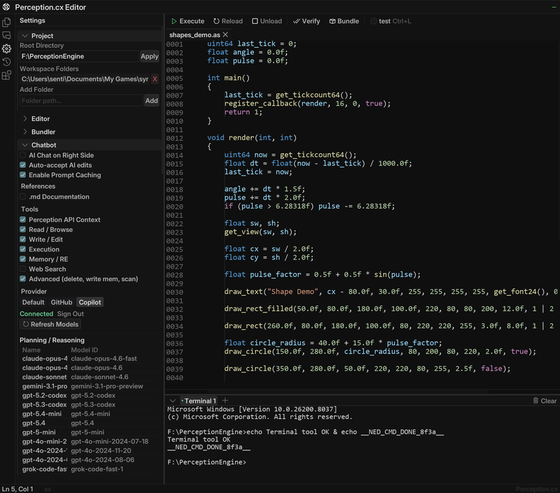
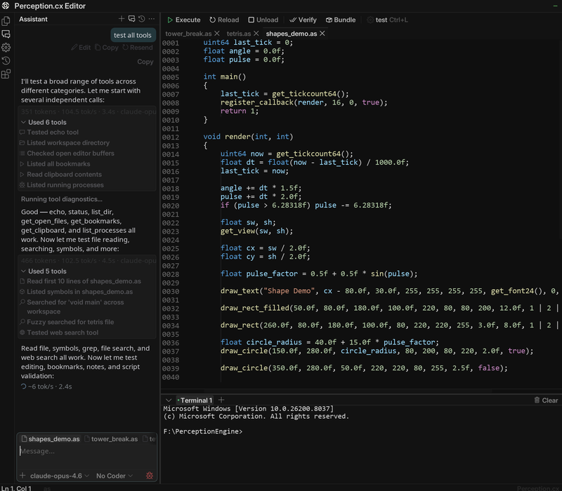
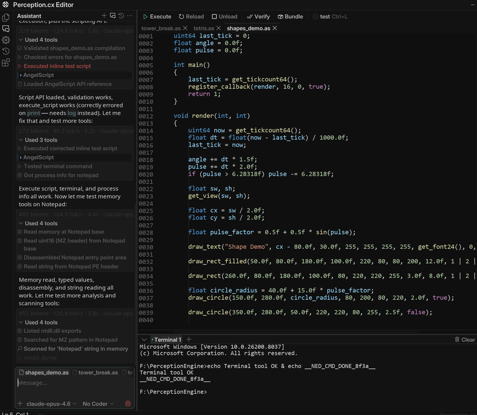

<div align="center">


<br><br>

# pcx-ai-toolkit

### The Complete AI-Powered Scripting Toolkit for Perception.cx

[](LICENSE)
[](#documentation-coverage)
[](#documentation-coverage)
[](#)
[](#perception-mcp-server)
[](#ai-skills)
[](https://github.com/VoidChecksum/pcx-ai-toolkit/releases)
[](https://github.com/VoidChecksum/pcx-ai-toolkit/actions/workflows/ci.yml)

**Turn any LLM into an expert Perception.cx developer.**<br>
Complete Enma language docs, every PCX API, coding guidelines, MCP configs, and LSP servers — in one package.

[Quick Start](#quick-start) · [Documentation](#documentation-coverage) · [AI Skills](#ai-skills) · [MCP Integration](#mcp-integration) · [Contributing](#contributing)

</div>

---

## The Problem

LLMs don't know Enma. They don't know the Perception.cx API. Ask them to write a PCX script and they hallucinate function names, invent parameters, and produce code that doesn't compile.

## The Solution

Give the AI **34,000+ lines of real documentation** and **12 coding rules** that prevent the most common mistakes. The AI reads the actual docs before writing code, follows real API signatures, and produces scripts that work.

```
Before:  "Write me an ESP overlay"
AI:      *invents draw_esp(), uses int for addresses, forgets null checks*
Result:  Doesn't compile. Wrong types. Silent crashes.

After:   "Write me an ESP overlay"  (with pcx-ai-toolkit loaded)
AI:      *reads render-api.md, uses draw_rect + draw_text, uint64 addresses, validates pointers*
Result:  Compiles. Runs. Correct API calls.
```

---

## Quick Start

**Linux / macOS / WSL / Git Bash:**
```bash
git clone --recursive https://github.com/VoidChecksum/pcx-ai-toolkit.git
cd pcx-ai-toolkit
./setup.sh
```

**Windows 10 / 11 (PowerShell):**
```powershell
git clone --recursive https://github.com/VoidChecksum/pcx-ai-toolkit.git
cd pcx-ai-toolkit
powershell -ExecutionPolicy Bypass -File setup.ps1
```

Drop the rules into your project and the AI reads docs before writing code:
```bash
cp rules/CLAUDE.md /path/to/your/pcx-project/   # Linux/macOS
copy rules\CLAUDE.md C:\path\to\your\project\   # Windows
```

> **Requirements:** [Node.js 18+](https://nodejs.org/) · [Git](https://git-scm.com/) · [Git LFS](https://git-lfs.github.com/) (for the analysis suite)

---

## Installation Guide

### Part 1 — Toolkit (docs, skills, rules, LSP)

This is the main repo. No binary payloads, no build step.

```bash
git clone --recursive https://github.com/VoidChecksum/pcx-ai-toolkit.git
cd pcx-ai-toolkit

# Linux / macOS / WSL
./setup.sh

# Windows
powershell -ExecutionPolicy Bypass -File setup.ps1
```

`setup.sh` / `setup.ps1` installs:
- LSP servers (Enma + AngelScript) built from submodules
- AI skills registered with Claude Code (if detected)
- Skill docs copied to `~/.claude/skills/`

---

### Part 2 — Analysis Suite (headless, fully automatic)

Installs the static analysis tool permanently for your OS, patches the binaries,
generates the license, activates the Python bindings, and wires up the binary
analysis MCP server for Claude Code — **zero interaction, one command**.

#### Prerequisites

| Prerequisite | Linux / WSL | macOS | Windows |
|---|---|---|---|
| [Node.js 18+](https://nodejs.org/) | `sudo apt-get install nodejs` | `brew install node` | installer from nodejs.org |
| [Xvfb](https://www.x.org/releases/individual/app/) | `sudo apt-get install xvfb` | not needed | not needed |
| Git LFS | `sudo apt-get install git-lfs` | `brew install git-lfs` | [git-lfs.github.com](https://git-lfs.github.com/) |
| Python 3.11+ | installed automatically via uv | installed automatically via uv | installed automatically via uv |

> **Why Xvfb?** The installer binary uses Qt for its UI layer even in unattended mode.
> The script spins up a throwaway virtual display, runs the installer through it, then
> tears it down. You never see a window.

#### Install

```bash
# Pull the installer binaries (stored in Git LFS, ~3 GB)
git lfs pull

# Linux / macOS / WSL — one command does everything
./installers/install.sh
```

```powershell
# Windows — run PowerShell as Administrator if installing to Program Files
git lfs pull
powershell -ExecutionPolicy Bypass -File installers\install.ps1
```

#### What happens, step by step

| Step | Linux / macOS | Windows |
|---|---|---|
| 1 | Checks Node.js + Xvfb are available | Checks Node.js is available |
| 2 | Spins up a Xvfb virtual display | — |
| 3 | Runs the native `.run` / `.app.zip` installer silently via `--mode unattended` | Runs `.exe` installer silently via `--mode unattended` |
| 4 | `node keygen.js` patches `libida.so` + `libida32.so` (or `.dylib`) in-place | Pre-patched `ida.dll` + `ida32.dll` dropped into the install dir |
| 5 | `node keygen.js` writes `idapro.hexlic` to the install dir | Same |
| 6 | Installs `uv` if not present | Same |
| 7 | Installs Python 3.11+ via uv if not present | Same |
| 8 | Activates idalib Python bindings via `py-activate-idalib.py` | Same |
| 9 | `uv tool install ida-pro-mcp` | Same |
| 10 | Merges `binary-analysis` entry into `~/.claude/mcp.json` | Merges into `%USERPROFILE%\.claude\mcp.json` |

#### Options

```bash
# Custom install location (default: /opt/ida-pro-9.3 or ~/ida-pro-9.3)
./installers/install.sh --prefix /opt/mydir

# Skip MCP server install (just install + patch the suite)
./installers/install.sh --skip-mcp
```

```powershell
# Custom install location (default: C:\Program Files\IDA Professional 9.3)
.\installers\install.ps1 -Prefix "D:\tools\ida"

# Skip MCP server install
.\installers\install.ps1 -SkipMcp
```

#### Already have it installed?

Skip the 3 GB download — just activate the bindings and wire up MCP:

```bash
# Linux / macOS / WSL
./mcp/setup-binary-analysis.sh                            # auto-detect install dir
./mcp/setup-binary-analysis.sh --install-dir /your/path  # explicit path
./mcp/setup-binary-analysis.sh --skip-pkg                # skip package download too
```

```powershell
# Windows
.\mcp\setup-binary-analysis.ps1
.\mcp\setup-binary-analysis.ps1 -InstallDir "D:\tools\ida"
.\mcp\setup-binary-analysis.ps1 -SkipPkg
```

#### After install

Restart Claude Code. The `binary-analysis` MCP server is now available:

```bash
# Headless — stdio (used automatically by Claude Code)
uvx idalib-mcp --stdio

# HTTP — for persistent sessions or multiple clients
uvx idalib-mcp --host 127.0.0.1 --port 8745

# Optional GUI plugin (connects to a live interactive session via SSE)
pip install ida-pro-mcp && ida-pro-mcp --install
```

Upgrade the MCP server at any time:
```bash
uv tool upgrade ida-pro-mcp
```

---

## What's Inside

<table>
<tr>
<td width="50%" valign="top">

### Documentation
110 pages, 35,000+ lines

- Complete Enma language spec
- All 18 standard library addons
- Full C++ SDK embedding guide
- Every PCX API (Enma, AngelScript, Lua)
- IDE, Extensions, Analyzer docs

</td>
<td width="50%" valign="top">

### AI Skills
18 Claude Code / OMC skills

- **game-hacking-pcx** — doc index, API rules
- **game-cheat-guidelines** — 12 behavioral rules (Enma)
- **pcx-angelscript-discipline** — 10 AS-specific rules (`@` handles, `&out`, `array<T>`)
- **pcx-lua-discipline** — 10 Lua-specific rules (int subtype, `pcall`, hot-reload)
- **pcx-coding-discipline** — Karpathy workflow: scripts
- **pcx-re-discipline** — Karpathy workflow: RE
- **pcx-debug-overlay** — diagnostic surfaces separate from production overlay
- **pcx-knowledge-index** — the three surfaces (llms.txt + bundles + MCP) and when to use each
- **ai-pair-programming** — workflow for driving Claude/Cursor/Cline/Aider/Copilot
- **re-evidence-log** — every offset cites its proof (`E-NNN` cross-refs)
- **pcx-patch-day-playbook** — ordered triage when the game updates
- **multi-binary-targeting** — one script across N game versions / arches / storefronts
- **script-bundler** — packaging, hot-reload boundaries, pre-ship hygiene
- **pcx-perf-budget** — frame-time targets + `mono_us` profiler recipe
- **pcx-streamproof** — capture-path taxonomy for OBS / Discord / capture cards
- **mcp-tool-routing** — which of the 37 Perception MCP tools for which task
- **anti-cheat-re** — kernel AC methodology
- **kernel-analysis** — driver analysis patterns

Auto-trigger on `.em` / `.as` / `.lua` work and PCX topics.

</td>
</tr>
<tr>
<td width="50%" valign="top">

### Knowledge Base
23 reference files

- Enma + PCX API cheatsheets
- Working code patterns (13 recipes)
- GUI design patterns (section layout, slider discipline, hotkey conventions)
- Cross-language bridge (Enma vs AngelScript vs Lua decision guide)
- Offset-finding methodology, RE plugin reference
- Aimbot math (atan2, FOV, prediction, smoothing)
- Multi-file script organization patterns (extends `templates/full-project/`)
- Network protocol RE (packet capture, dissection, wire-to-memory mapping)
- PCX API version matrix (since-version table sourced from changelogs)
- Anti-cheat architecture (EAC/BE/Vanguard/...) + kernel-RE tools
- 5 engine RE references: CryEngine, Frostbite, RE Engine, REDengine, Godot

</td>
<td width="50%" valign="top">

### Tooling & Indexed Knowledge
MCP + LSP + Rules + 3 LLM-knowledge surfaces

- **Perception MCP** (42+ live-process tools)
- **pcx-knowledge-mcp** (search + fetch over 211 docs)
- **Enma + AngelScript LSPs** (syntax, completion, hover)
- **`docs/llms.txt`** + 6 concatenated context-pack bundles
- **Rules drop-ins** for Claude / Cursor / Cline / Copilot
- **16 standalone tools** (Python + bash, stdlib-only)
</td>
</tr>
</table>

---

## Indexed Knowledge Surfaces

Three complementary surfaces let any AI tool reach the toolkit's corpus efficiently. Pick by integration model; see [`.claude/skills/pcx-knowledge-index/SKILL.md`](.claude/skills/pcx-knowledge-index/SKILL.md) for the full decision tree.

| # | Surface | What it is | Who uses it | Cost |
|---|---------|------------|-------------|------|
| 1 | [`docs/llms.txt`](docs/llms.txt) | 45 KB structured index (Anthropic / Mintlify convention) | Tools that auto-fetch the convention (Claude, Cursor, ...) | 45 KB context |
| 2 | `docs/llms-perception-{enma,angelscript,lua}.md` | Per-language concatenated context packs (215 KB - 950 KB) | Aider `/read`, Cursor / Continue `@file`, Copilot paste | bundle size |
| 2 | [`docs/llms-skills.md`](docs/llms-skills.md) / [`llms-knowledge.md`](docs/llms-knowledge.md) | All 18 skills / all 23 knowledge refs concatenated | Same as above, category-focused | 300-350 KB |
| 2 | [`docs/llms-full.txt`](docs/llms-full.txt) | Full corpus concatenation (~2 MB) | All-language sessions in non-MCP tools | 2 MB context |
| 3 | [`mcp/pcx-knowledge-mcp/`](mcp/pcx-knowledge-mcp/) | Python MCP server with `search` / `get_file` / `list_files` / `overview` | Claude Desktop, Cline, Continue, Zed, any MCP-aware tool | one process, <100 ms cold |

All static bundles are generated by [`tools/build-llms-index.py`](tools/build-llms-index.py). CI runs `build-llms-index.py --check` on every push; the build fails if the committed bundles drift from the source.

**Combine #2 + #3** for the best of both worlds: small upfront context for your primary language + searchable depth for everything else. Recommended for long sessions.

## Perception IDE — Built-In Script Editor and AI Assistant

<div align="center">

<table>
<tr>
<td align="center">
<strong>Script Editor + Settings</strong><br>

</td>
<td align="center">
<strong>AI Chat + Tool Calls</strong><br>

</td>
</tr>
<tr>
<td align="center" colspan="2">
<strong>42+ RE Tools available via MCP</strong><br>

</td>
</tr>
</table>

<sub>Screenshots from the <a href="https://docs.perception.cx/perception/perception-ide">Perception IDE documentation</a></sub>

</div>

---

## Directory Structure

```
pcx-ai-toolkit/
│
├── docs/                             110 pages of documentation
│   ├── enma/                         ── Enma language, addons, SDK (50 files)
│   │   ├── llms-language.md              Complete language reference (2,861 lines)
│   │   ├── llms-sdk.md                   Complete SDK reference (832 lines)
│   │   ├── lang-*.md                     Language guide (10 files)
│   │   ├── addon-*.md                    18 standard library addons
│   │   └── sdk-*.md                      SDK embedding guide (17 files)
│   │
│   └── perception/                   ── Perception.cx platform APIs
│       ├── *.md                          Enma APIs (17 files)
│       ├── angelscript/                  AngelScript APIs (23 files)
│       └── lua/                          Lua APIs (17 files)
│
├── .claude/skills/                   ── AI Skills (18)
│   ├── game-hacking-pcx/                Doc index + coding rules
│   ├── game-cheat-guidelines/           12 behavioral guidelines (Enma)
│   ├── pcx-angelscript-discipline/      10 AS-specific rules
│   ├── pcx-lua-discipline/              10 Lua-specific rules
│   ├── pcx-coding-discipline/           Karpathy workflow — writing scripts
│   ├── pcx-re-discipline/               Karpathy workflow — reverse engineering
│   ├── ai-pair-programming/             Driving Claude/Cursor/Cline/Aider/Copilot well
│   ├── re-evidence-log/                 Evidence-citation discipline (E-NNN cross-refs)
│   ├── pcx-patch-day-playbook/          Patch-day triage workflow (7 steps)
│   ├── multi-binary-targeting/          One script, N versions/arches/storefronts/channels
│   ├── script-bundler/                  Packaging + ship-day hygiene + .emb workflow
│   ├── pcx-perf-budget/                 Frame-time targets + profiler recipe
│   ├── pcx-streamproof/                 Capture-path taxonomy for OBS / Discord / cards
│   ├── pcx-debug-overlay/               Diagnostic / profiler / status overlay (gated, read-only)
│   ├── pcx-knowledge-index/             How AI tools reach the corpus: llms.txt + bundles + MCP
│   ├── mcp-tool-routing/                Decision guide across the 37 Perception MCP tools
│   ├── anti-cheat-re/                   Kernel AC RE methodology (6 steps)
│   └── kernel-analysis/                 Driver analysis patterns (WDM/KMDF)
│
├── knowledge/                        ── Quick References
│   ├── enma-cheatsheet.md                Language quick-ref card
│   ├── pcx-api-cheatsheet.md             All APIs at a glance
│   ├── pcx-version-matrix.md             Since-version API matrix (sourced from changelogs.md)
│   ├── pcx-cross-language-bridge.md      Enma vs AngelScript vs Lua decision guide
│   ├── gui-design-patterns.md            PCX sidebar layout + slider/hotkey/color discipline
│   ├── script-organization-patterns.md   Multi-file project organization beyond full-project/
│   ├── anti-cheat-architecture.md        EAC/BE/Vanguard/GG architecture + detection matrix
│   ├── kernel-re-tools.md                Kernel RE tool reference (WinDbg, HyperDbg, Volatility, etc.)
│   ├── common-patterns.md                13 working code recipes
│   ├── re-plugins-and-tools.md           IDA/Ghidra plugins, FLIRT sigs, diffing, ret-sync
│   ├── offset-methodology.md             Sig scanning methodology
│   ├── aimbot-math.md                    angles, FOV, prediction, recoil comp, smoothing
│   ├── engine-cryengine.md               CryEngine family (Hunt: Showdown, Star Citizen, KCD)
│   ├── engine-frostbite.md               Frostbite (Battlefield, FIFA, Anthem, Andromeda)
│   ├── engine-godot.md                   Godot 3.x / 4.x (Brotato, Cassette Beasts, Halls of Torment)
│   ├── engine-re-engine.md               RE Engine (RE2/3/4, MH Rise/Wilds, SF6, DD2)
│   ├── network-protocol-re.md            Packet capture + dissection + wire-to-memory mapping
│   └── engine-redengine.md               REDengine (Cyberpunk 2077, Witcher 3)
│
├── installers/                       ── Analysis Suite Installers (Git LFS)
│   ├── install.sh                        Full install — Linux / macOS / WSL
│   ├── install.ps1                       Full install — Windows
│   ├── keygen.js                         License generator + in-place patcher
│   ├── ida-pro_93_x64linux.run           Linux x64 installer  [LFS]
│   ├── ida-pro_93_armlinux.run           Linux ARM64 installer [LFS]
│   ├── ida-pro_93_x64mac.app.zip         macOS x64 installer  [LFS]
│   ├── ida-pro_93_armmac.app.zip         macOS ARM64 installer [LFS]
│   ├── ida-pro_93_x64win.exe             Windows x64 installer [LFS]
│   └── kg_patch/win/                     Pre-patched Windows DLLs [LFS]
│
├── rules/                            ── Project Rules
│   ├── CLAUDE.md                         Drop-in for Claude Code
│   ├── CURSOR.md                         Drop-in `.cursorrules` for Cursor
│   ├── CLINE.md                          Drop-in custom instructions for Cline (VS Code agent)
│   ├── COPILOT.md                        Drop-in `.github/copilot-instructions.md` for GitHub Copilot
│   ├── AGENTS.md                         6 agent role definitions
│   └── KARPATHY.md                       Work-discipline drop-in (4 principles)
│
├── mcp/                              ── MCP Configs
│   ├── perception-mcp-config.json        42+ tool definitions
│   ├── claude-code-setup.md              Claude Code guide
│   ├── cursor-setup.md                   Cursor guide
│   ├── aider-setup.md                    Aider CLI integration (.aider.conf.yml, CONVENTIONS.md)
│   ├── continue-setup.md                 Continue extension (VS Code / JetBrains) integration
│   ├── zed-setup.md                      Zed editor MCP + agent panel setup
│   ├── binary-analysis-setup.md          Binary analysis MCP reference
│   ├── setup-binary-analysis.sh          MCP-only setup (if already installed)
│   ├── setup-binary-analysis.ps1         MCP-only setup — Windows
│   └── pcx-knowledge-mcp/                MCP server: search + fetch over the toolkit corpus
│
├── lsp/                              ── Language Servers (submodules)
│   ├── enma-lsp/                         Enma: completion + diagnostics
│   └── angel-lsp-pcx/                   AngelScript: completion + diagnostics
│
├── visualstudio/                     ── Visual Studio 2022 Extensions
│   ├── EnmaVS/                           Enma ILanguageClient (.vsix source)
│   └── AngelScriptVS/                    AngelScript ILanguageClient (.vsix source)
│
├── templates/                       ── Starter Scripts
│   ├── hello-world.em                    Minimal lifecycle + render
│   ├── overlay-basic.em                  GUI menu + config-driven overlay
│   ├── aimbot-skeleton.em                Closest-target-in-FOV with smoothing + RIP resolver
│   ├── minimap.em                        Rotation-aware radar with rim clamping
│   ├── full-project/                     5-file Enma project scaffold
│   └── full-project-as/                  3-file AngelScript scaffold (globals.as, feature.as, main.as)
│
├── signatures/source-engine/         ── Signature Examples
├── signatures/unreal-engine/         ── UE Reversal (GWorld, GObjects, Dumper-7)
├── signatures/anti-cheat/            ── AC Driver Patterns (EAC, BE, Vanguard, callbacks)
├── signatures/unity-il2cpp/          ── IL2CPP Patterns (metadata, static fields, schemas)
├── signatures/source2-engine/        ── Source 2 Patterns (schema system, entity list, W2S)
├── signatures/obfuscation/           ── Protector ID Patterns (VMP, Themida, OLLVM, packers)
│
├── tools/                            ── Standalone RE Tools (Python, no deps beyond stdlib)
│   ├── identify-protector.py            Detect VMProtect/Themida/UPX/etc. by sections + byte sigs
│   ├── pe-section-analyzer.py           Entropy analysis, packing detection, anomaly flagging
│   ├── resolve-api-hashes.py            Resolve API hashes (ROR13, CRC32, DJB2, FNV-1a, MurmurHash3, SDBM)
│   ├── dump-strings-xor.py              Extract XOR-encrypted strings (brute-force single-byte keys)
│   ├── anti-debug-scanner.py            Flag anti-debug surfaces in a PE (PEB / RDTSC / IsDebuggerPresent / window class)
│   ├── module-export-mapper.py          List exports; cross-reference which consumers import each
│   ├── offset-diff.py                   Diff named sigs between two binary versions (patch-day workflow)
│   ├── sig-uniqueness-checker.py        Verdict per sig: UNIQUE / AMBIGUOUS / STALE / BRITTLE
│   ├── pattern-format-converter.py      Round-trip patterns: IDA / Ghidra / x64dbg / CE / Enma / C
│   ├── dumper-to-enma.py                Dumper-7 / IL2CPPDumper / hazedumper → offsets.em
│   ├── binary-diff-summary.py           High-level diff between two PE versions (% changed, verdict)
│   ├── evidence-log-validator.py        Cross-check offsets.em vs evidence/<hash>.md citations
│   ├── script-linter.py                 Light 12-guidelines static check on .em files
│   ├── pre-ship-check.sh                Pre-release hygiene checklist (12 checks, --json output)
│   ├── install-re-tools.sh              One-command installer: IDA/Ghidra plugins + Python packages
│   └── build-llms-index.py              Generate docs/llms.txt + bundles (--check for CI drift)
├── setup.sh                          One-command LSP + skills install
├── CONTRIBUTING.md                   Contribution guide
└── LICENSE                           MIT
```

---

## Documentation Coverage

> **107 out of 107 gitbook pages — 100% coverage of both the Enma and Perception.cx documentation.**

<table>
<tr>
<th>Corpus</th>
<th>Files</th>
<th>Lines</th>
<th>Coverage</th>
</tr>
<tr>
<td><strong>Enma Language</strong></td>
<td align="center">50</td>
<td align="center">13,518</td>
<td>Every type, operator, control flow, function, pointer, struct, class, template, coroutine, exception, FFI, annotation, module, preprocessor + all 18 addons + full SDK</td>
</tr>
<tr>
<td><strong>PCX Enma APIs</strong></td>
<td align="center">17</td>
<td align="center">3,915</td>
<td>Proc, Render, GUI, Input, CPU, Zydis, Unicorn, Net, Win, Filesystem, Sound, Lifecycle, MCP, IDE, Extensions, Analyzer</td>
</tr>
<tr>
<td><strong>PCX AngelScript APIs</strong></td>
<td align="center">23</td>
<td align="center">10,820</td>
<td>All of the above + Intrinsics, Zydis Encoder, Bit Reinterpret, Mutex, Atomic Types, CS2 Extended</td>
</tr>
<tr>
<td><strong>PCX Lua APIs</strong></td>
<td align="center">17</td>
<td align="center">5,779</td>
<td>All core APIs in Lua syntax</td>
</tr>
<tr>
<td><strong>Total</strong></td>
<td align="center"><strong>110</strong></td>
<td align="center"><strong>35,222</strong></td>
</tr>
</table>

Plus **7 generated bundles** at `docs/llms-*.{txt,md}` (~4.5 MB total) — the indexed-knowledge surface generated by [`tools/build-llms-index.py`](tools/build-llms-index.py). See the [Indexed Knowledge Surfaces](#indexed-knowledge-surfaces) section above.

### Enma Language Docs Breakdown

<details>
<summary><strong>Language Guide</strong> — 10 files, 3,150 lines (click to expand)</summary>

| File | Lines | Topics |
|------|------:|--------|
| `lang-basics.md` | 267 | Types, variables, constants, operators, control flow |
| `lang-functions.md` | 247 | Parameters, defaults, refs, out, variadic, lambdas, closures |
| `lang-pointers.md` | 357 | Heap pointers, address-of, member access, null, return-by-ref |
| `lang-structs-and-classes.md` | 912 | Value/ref types, inheritance, vtable, interfaces, mixins, operators |
| `lang-templates.md` | 173 | Generic structs and functions, monomorphization |
| `lang-advanced.md` | 562 | Delegates, namespaces, coroutines, exceptions, smart ptrs, FFI |
| `lang-annotations.md` | 209 | packed, align, reflect, serialize, export, dll, custom |
| `lang-modules.md` | 100 | Import system, aliased imports, .emb, multi-module linking |
| `lang-pre-processor.md` | 77 | #define, #ifdef, #include, #pragma |
| `lang-semantics-and-limits.md` | 181 | Guarantees, compile-time rejects, what doesn't exist |

</details>

<details>
<summary><strong>Standard Library Addons</strong> — 18 files, 2,528 lines (click to expand)</summary>

| Addon | Lines | Key Types / Functions |
|-------|------:|----------------------|
| Core | 42 | `print`, `println` |
| Strings | 165 | `format`, `to_int`, `split`, `replace`, `substr`, interpolation |
| Arrays | 119 | `T[]`, `push`, `pop`, `sort`, `contains`, `slice` |
| Maps | 200 | `map<K,V>`, `imap<V>`, `get`, `set`, iteration |
| Math | 137 | `sin`, `cos`, `atan2`, `sqrt`, `clamp`, `lerp`, `random` |
| SIMD | 128 | SSE2: `f32x4`, `i32x4` vector ops |
| Vectors | 135 | `vec2`, `vec3`, `vec4` |
| 3D Math | 182 | `quat`, `mat4` |
| Variant | 130 | Type-erased value container |
| Atomic | 94 | `aint32`, `aint64` atomic ops |
| Bits | 117 | `popcount`, `clz`, `ctz`, `bswap`, `rotl` |
| Time | 95 | `time_ms`, `time_us`, ISO 8601, `sleep` |
| Regex | 61 | `match`, `find`, `replace`, `split`, captures |
| File | 125 | Sandboxed file I/O (permission-gated) |
| Thread | 120 | `mutex`, `lock_guard`, `condition_variable` |
| Hash Set | 89 | `hash_set<T>` |
| Sorted Map | 89 | `sorted_map<K,V>` ordered iteration |
| List | 192 | Double-ended O(1) push/pop |
| JSON | 108 | `json_parse`, `json_stringify`, `json_value` |

</details>

<details>
<summary><strong>SDK Embedding Guide</strong> — 17 files, 3,795 lines (click to expand)</summary>

| File | Lines | Topic |
|------|------:|-------|
| `sdk-quick-start.md` | 126 | Minimal embedding example |
| `sdk-engine-lifecycle.md` | 166 | Create, configure, destroy |
| `sdk-compilation.md` | 65 | Compile from source/files |
| `sdk-execution.md` | 103 | Contexts, execute, read returns |
| `sdk-calling-functions.md` | 82 | Pass arguments from host |
| `sdk-globals.md` | 79 | Read/write script globals |
| `sdk-type-registration.md` | 862 | type_builder — expose native types |
| `sdk-native-functions.md` | 446 | Register host-callable functions |
| `sdk-hot-reload.md` | 64 | Replace code at runtime |
| `sdk-serialization-and-linking.md` | 97 | .emb binaries, multi-module |
| `sdk-introspection.md` | 317 | List functions, annotations, IR dump |
| `sdk-lifecycle.md` | 227 | Deterministic RAII, no GC |
| `sdk-debug-and-gc.md` | 202 | Debug hooks, budgets, heap stats |
| `sdk-error-handling.md` | 116 | Compile/runtime error reporting |
| `sdk-safety.md` | 121 | Fault trapping, sandboxing, permissions |
| `sdk-custom-addons.md` | 576 | Build your own addon |
| `sdk-api-reference.md` | 411 | Complete function listing |

</details>

---

## AI Skills

### `game-hacking-pcx` — Documentation Router

Forces the AI to read the correct doc file before writing any PCX API call.

```
User:  "Write me a render overlay"
AI:    → reads docs/perception/render-api.md (264 lines)
       → reads docs/perception/lifecycle-and-routines.md (134 lines)
       → writes code using real function signatures
```

Contains: file-by-file index of all 107 docs, critical Enma type rules, address type requirements, RAII notes.

### `game-cheat-guidelines` — 12 Behavioral Rules

<table>
<tr><td width="5%" align="center"><strong>#</strong></td><td width="30%"><strong>Rule</strong></td><td><strong>What It Prevents</strong></td></tr>
<tr><td align="center">1</td><td>Ground every offset</td><td>Hours wasted on stale offsets from an old SDK version</td></tr>
<tr><td align="center">2</td><td><code>uint64</code> for all addresses</td><td>Sign-extension corruption on high usermode addresses</td></tr>
<tr><td align="center">3</td><td>Validate every pointer</td><td>Silent null reads returning plausible-looking garbage</td></tr>
<tr><td align="center">4</td><td>Separate update from render</td><td>Overlay stutter when memory reads block the draw path</td></tr>
<tr><td align="center">5</td><td>Sigs over hardcodes</td><td>Script breaking on every game patch</td></tr>
<tr><td align="center">6</td><td>One feature, one file</td><td>2000-line monoliths that can't be hot-reloaded</td></tr>
<tr><td align="center">7</td><td>Construct colors/vecs per frame</td><td>Pointless globals for 4-byte stack-allocated structs</td></tr>
<tr><td align="center">8</td><td><code>f</code> suffix on float32</td><td>Silent float64→float32 truncation in vertex buffers</td></tr>
<tr><td align="center">9</td><td>Minimize memory writes</td><td>Unnecessary detection surface area</td></tr>
<tr><td align="center">10</td><td>W2S once, correctly</td><td>Behind-camera coordinate mirroring, wrong matrix layout</td></tr>
<tr><td align="center">11</td><td>GUI for all tunables</td><td>Recompiling just to change a distance threshold</td></tr>
<tr><td align="center">12</td><td>Verify with the binary</td><td>Trusting stale cached offsets over live reality</td></tr>
</table>

Each rule includes wrong/right code examples using real Perception.cx APIs.

### `pcx-coding-discipline` — Karpathy Workflow for Writing Scripts

The four Karpathy principles rewritten for script development: state the target and tradeoff before coding, ship the simplest feature that works, keep edits to one feature per diff, and define "done" as visible success criteria on the live target — not "it compiles."

### `pcx-re-discipline` — Karpathy Workflow for Reverse Engineering

The same four principles for offset work: hypothesize and cite evidence before trusting a field, find the shortest unique signature, re-verify only what a patch broke, and trust live memory over a stale SDK. The discipline layer above `game-cheat-guidelines`' code-shape rules.

### `anti-cheat-re` — Kernel Anti-Cheat RE Methodology

Six-step workflow for reversing kernel-level anti-cheat systems (EAC, BattlEye, Vanguard, GameGuard, XIGNCODE3): map the component stack, catalog every kernel callback, trace the driver↔user-mode communication channel, identify what the AC actually scans for, analyze from below the AC's observation layer, and verify findings against live behavior.

### `kernel-analysis` — Driver Analysis Patterns

Technical patterns for reversing Windows kernel drivers: identify WDM vs KMDF, extract the IOCTL dispatch table and decode `CTL_CODE`, enumerate registered kernel callbacks with structures and WinDbg commands, analyze integrity check routines (hashing, RDTSC timing, CPUID hypervisor detection, unsigned driver scanning), decode obfuscation layers (import resolution, encrypted strings, control flow flattening, VMProtect), and reconstruct shared memory communication channels.

### Plus 12 more skills

`pcx-angelscript-discipline` · `pcx-lua-discipline` · `re-evidence-log` · `pcx-patch-day-playbook` · `multi-binary-targeting` · `script-bundler` · `pcx-perf-budget` · `pcx-streamproof` · `pcx-debug-overlay` · `pcx-knowledge-index` · `ai-pair-programming` · `mcp-tool-routing`

Browse the full set at [`.claude/skills/`](.claude/skills/). Every skill auto-triggers on relevant keywords / file extensions.

---

## Knowledge Base

<table>
<tr>
<td width="50%" valign="top">

### Enma Cheatsheet
> `knowledge/enma-cheatsheet.md` — 164 lines

Every primitive type with size, all conversion rules, control flow, functions, structs vs classes, templates, arrays, maps, strings, pointers, coroutines, exceptions, modules, preprocessor, annotations.

### PCX API Cheatsheet
> `knowledge/pcx-api-cheatsheet.md` — 232 lines

Every function signature across all 13 Perception.cx APIs: Proc, Render, GUI, Input, CPU, Zydis, Unicorn, Net, Win, Filesystem, Sound, Lifecycle, MCP.

</td>
<td width="50%" valign="top">

### Common Patterns
> `knowledge/common-patterns.md` — 339 lines

13 complete working examples:
- Process attach + module resolve
- Pattern scan + RIP resolution
- Entity list with null guards
- World-to-screen (4x4 matrix)
- Box overlay + health bars
- Snaplines, distance text
- Angle calc, smooth interp
- GUI menu, config save/load
- Minimap / radar with rotation
- Full script skeleton

### Offset Methodology
> `knowledge/offset-methodology.md` — 130 lines

Pattern scanning, wildcard strategy, RIP-relative resolution table, pointer chain walking, struct_dump discovery, IDA/Ghidra cross-referencing, offset table format, patch stability analysis.

### Anti-Cheat Architecture
> `knowledge/anti-cheat-architecture.md`

Per-AC architecture reference (EAC, BattlEye, Vanguard, GameGuard, XIGNCODE3, Theia): components, driver behavior, communication protocols, known detection vectors, detection technique matrix. Includes AC-by-game mapping for all PCX-supported titles.

### Kernel RE Tools
> `knowledge/kernel-re-tools.md`

Tool reference for kernel-level RE: static analysis (IDA, Ghidra, r2), kernel debugging (WinDbg, VirtualKD-Redux, HyperDbg), memory forensics (Volatility 3, MemProcFS, PCILeech), runtime monitoring (Process Monitor, IRPMon), driver development/testing (WDK, OSR Driver Loader), and Perception.cx kernel integration.

### RE Plugins & Tools
> `knowledge/re-plugins-and-tools.md`

Complete reference for the installed RE toolkit: 6 IDA plugins (hrtng deobfuscation, CodeXplorer vtable recovery, ClassInformer RTTI, SigMakerEx pattern generation, FIRST function fingerprints, RevEng.AI similarity), 4 Ghidra extensions (GhidrAssist LLM integration, BinDiffHelper, OOAnalyzer C++ recovery, RevEng.AI), 3 FLIRT signature databases (51 pre-selected MSVC v15 sigs), Diaphora + BinDiff for cross-patch analysis, ret-sync for live debugger↔disassembler sync, and 2,438 reversed r5sdk headers.

</td>
</tr>
</table>

### Plus 17 more knowledge files

Browse the full set at [`knowledge/`](knowledge/). Topics include: `aimbot-math` · `gui-design-patterns` · `script-organization-patterns` · `pcx-version-matrix` · `pcx-cross-language-bridge` · `network-protocol-re` · 5 engine RE references (CryEngine, Frostbite, RE Engine, REDengine, Godot) · obfuscation taxonomy · deobfuscation tools · game targets · custom draw patterns · community tools.

---

## MCP Integration

### Perception MCP Server

> 42+ tools exposed via JSON-RPC — connect any MCP-compatible AI to Perception's live tooling.

<details>
<summary><strong>Full tool list</strong> (click to expand)</summary>

**Process Memory**
`read_memory` · `read_typed_value` · `find_pattern` · `read_pointer_chain` · `read_string` · `memory_write`

**Analysis**
`disassemble` · `struct_dump` · `find_xrefs` · `find_string_refs` · `find_function_bounds` · `analyze_function` · `trace_register` · `analyze_vtable` · `read_rtti` · `generate_signature` · `build_call_graph`

**Scanning**
`scan_string` · `scan_wstring` · `scan_pointer_to` · `scan_value` · `scan_changed` · `diff_memory`

**Process Info**
`list_processes` · `get_process_info` · `get_module_exports` · `get_module_imports`

**Files & Scripts**
`read_file` · `write_file` · `edit_file` · `search_text` · `find_references` · `check_script` · `validate_script` · `execute_script` · `get_script_api` · `web_search`

</details>

Config: [`mcp/perception-mcp-config.json`](mcp/perception-mcp-config.json)

### Supported AI Tools

| Tool | How | Guide |
|:-----|:----|:------|
| **Claude Code** | Skills + CLAUDE.md + MCP | [`claude-code-setup.md`](mcp/claude-code-setup.md) |
| **Claude Desktop** | `pcx-knowledge-mcp` for search; bundles for preload | [`pcx-knowledge-mcp/README.md`](mcp/pcx-knowledge-mcp/README.md) |
| **Cursor** | `.cursorrules` + MCP + `@docs` bundles | [`cursor-setup.md`](mcp/cursor-setup.md) |
| **Cline** | MCP config + `rules/CLINE.md` | Wire `pcx-knowledge-mcp` per the README |
| **Aider** | `CONVENTIONS.md` + `/read` bundles | [`aider-setup.md`](mcp/aider-setup.md) |
| **Continue** | `.continue/config.yaml` `mcpServers` block | [`continue-setup.md`](mcp/continue-setup.md) |
| **Zed** | `context_servers` in `settings.json` | [`zed-setup.md`](mcp/zed-setup.md) |
| **GitHub Copilot** | `.github/copilot-instructions.md` + bundle excerpts | [`rules/COPILOT.md`](rules/COPILOT.md) |
| **Perception IDE** | Native — built-in AI chat | Add `docs/` as workspace folder |
| **Any OpenAI-compatible** | System prompt + docs | Paste `rules/CLAUDE.md` into prompt |

---

## Templates

Ready-to-fill starter scripts, all following the 12 guidelines. See [`templates/`](templates/).

| Template | What it demonstrates |
|:---------|:---------------------|
| [`hello-world.em`](templates/hello-world.em) | Minimal script — lifecycle, render routine, text drawing |
| [`overlay-basic.em`](templates/overlay-basic.em) | GUI menu, config-driven rendering, update/render separation, input polling, FPS readout |
| [`aimbot-skeleton.em`](templates/aimbot-skeleton.em) | FOV-based closest-target picker with smoothing + RIP-relative offset resolver |
| [`minimap.em`](templates/minimap.em) | Rotation-aware player-relative radar with rim clamping + GUI tunables |
| [`full-project/`](templates/full-project/) | 5-file Enma scaffold: `globals` · `offsets` · `feature` · `menu` · `main` — one concern per file |
| [`full-project-as/`](templates/full-project-as/) | 3-file AngelScript scaffold: `globals.as` · `feature.as` · `main.as` — parallel to the Enma version |

Each is a correct skeleton: the structure and API calls are real, the offsets and read logic are placeholders you fill for your target.

---

## Editor Extensions

Prebuilt extensions are attached to every [release](https://github.com/VoidChecksum/pcx-ai-toolkit/releases) — no build step needed. Both VS Code and Visual Studio 2022 are supported.

### VS Code

Download the `.vsix`, then command palette (`Ctrl+Shift+P`) → **Extensions: Install from VSIX...**

| Extension | Language | Provides |
|:----------|:---------|:---------|
| `enma-language-*.vsix` | Enma (`.em`) | Syntax highlighting, completion, hover docs (full Perception API bundled), diagnostics, snippets |
| `angel-lsp-*.vsix` | AngelScript (`.as`) | Syntax highlighting, completion, hover docs, diagnostics, Perception API surface |

### Visual Studio 2022

Double-click the `.vsix`, or **Extensions → Manage Extensions → Install from VSIX**. Requires [Node.js 18+](https://nodejs.org/) on PATH.

| Extension | Language | Provides |
|:----------|:---------|:---------|
| `PcxEnmaVS.vsix` | Enma (`.em`) | Completion, hover docs, diagnostics via LSP |
| `PcxAngelScriptVS.vsix` | AngelScript (`.as`) | Completion, hover docs, diagnostics via LSP |

VS extensions are native `ILanguageClient` MEF components — see [`visualstudio/`](visualstudio/) for source and build details.

All extensions are MIT-licensed builds of [enma-lsp](https://github.com/sinnafuls/enma-lsp) and [angel-lsp-pcx](https://github.com/sinnafuls/angel-lsp-pcx).

### Manual / headless LSP

`setup.sh` / `setup.ps1` build the servers from source. Wire them into any LSP client:

```
# Linux / macOS
Enma:        node lsp/enma-lsp/server/dist/server.js --stdio
AngelScript: node lsp/angel-lsp-pcx/server/out/server.js --stdio

# Windows
Enma:        node lsp\enma-lsp\server\dist\server.js --stdio
AngelScript: node lsp\angel-lsp-pcx\server\out\server.js --stdio
```

---

## Project Rules

### `rules/CLAUDE.md` — Drop-In Project Config

Copy into any PCX scripting project. Covers:
- Language and API declarations
- Documentation paths
- Coding standards (address types, float suffixes, RAII, conversions)
- The 12 guidelines in one-line form
- Recommended file structure

### `rules/KARPATHY.md` — Work-Discipline Drop-In

Companion to `CLAUDE.md`. Where `CLAUDE.md` covers *what the code looks like*, this covers *how to work*: the four Karpathy principles (think before coding, simplicity first, surgical changes, goal-driven execution) condensed to one screen and framed for cheat development. Copy both into your project.

### `rules/CURSOR.md` — Cursor `.cursorrules` Drop-In

Parallel to `rules/CLAUDE.md` but tailored for Cursor's tighter token budget. Copy to project root as `.cursorrules` or paste into Cursor's `Rules for AI` setting.

### `rules/CLINE.md` — Cline (VS Code) Custom Instructions

Custom instructions for the [Cline](https://github.com/cline/cline) VS Code AI agent. Includes Cline-specific notes on auto-approval gating (read-only MCP tools safe, write/execute gated), Plan/Act mode workflow, and token-budget guidance.

### `rules/COPILOT.md` — GitHub Copilot Drop-In

Save as `.github/copilot-instructions.md` for repo-wide application, or paste into Copilot's custom-instructions field. Copilot-specific notes on what it's good/bad at, steering via `// from: docs/...` comments above the cursor.

### `rules/AGENTS.md` — Multi-Agent Role Definitions

Six specialist roles for orchestrated workflows:

| Agent | Responsibility |
|:------|:---------------|
| **reverse-engineer** | Binary analysis, sig generation, offset discovery |
| **script-writer** | Enma/AngelScript implementation following all rules |
| **offset-maintainer** | Post-patch offset table updates and verification |
| **feature-builder** | Feature implementation using common patterns |
| **reviewer** | Correctness, style, and detection surface review |
| **anti-cheat-researcher** | Kernel AC analysis, callback mapping, driver RE |

---

## Contributing

See [CONTRIBUTING.md](CONTRIBUTING.md) for full details.

1. Fork and clone with `--recursive`
2. Add or improve: docs, patterns, templates, sigs, knowledge files
3. Test with `./setup.sh` on a clean clone
4. Open a PR

New working patterns and documentation improvements are especially welcome.

---

<div align="center">

## License

[MIT](LICENSE)

---

**Credits**

[Perception.cx](https://perception.cx) · [Enma Language](https://enma-1.gitbook.io/enma) · [enma-lsp](https://github.com/sinnafuls/enma-lsp) · [angel-lsp-pcx](https://github.com/sinnafuls/angel-lsp-pcx)

</div>
